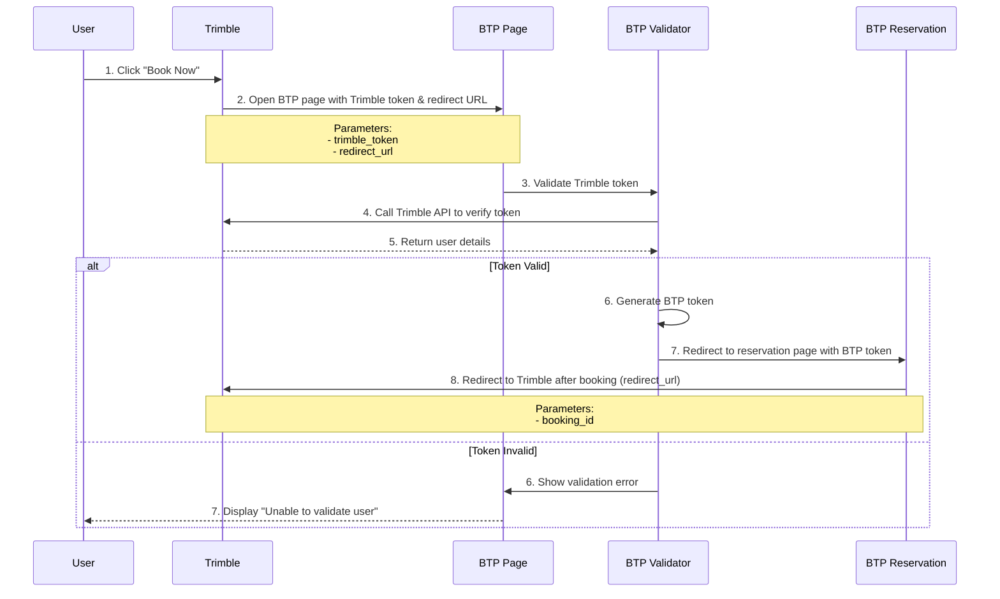

```mermaid

sequenceDiagram
    participant U as User
    participant T as Trimble
    participant B as BTP Page
    participant V as BTP Validator
    participant R as BTP Reservation
    
    %% Initial Flow
    U->>T: 1. Click "Book Now"
    T->>B: 2. Open BTP page with Trimble token & redirect URL
    Note over T,B: Parameters:<br/>- trimble_token<br/>- redirect_url
    
    %% Token Validation
    B->>V: 3. Validate Trimble token
    V->>T: 4. Call Trimble API to verify token
    T-->>V: 5. Return user details
    
    alt Token Valid
        V->>V: 6. Generate BTP token
        V->>R: 7. Redirect to reservation page with BTP token
        
        %% Completion and Redirect
        R->>T: 8. Redirect to Trimble after booking (redirect_url)
        Note over R,T: Parameters:<br/>- booking_id
        
    else Token Invalid
        V->>B: 6. Show validation error
        B-->>U: 7. Display "Unable to validate user"
    end
```
